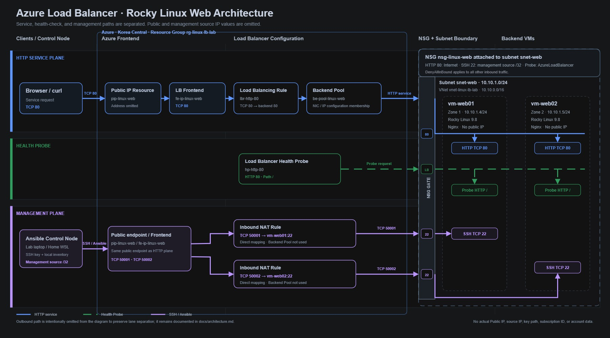

# 아키텍처

이 문서는 현재 구성과 통신 경로만 정리한다. 날짜별 작업 과정과 장애 실험은 `PROJECT_LOG.md`, `TROUBLESHOOTING.md`, `commands/`에 따로 남긴다.

실제 Load Balancer Public IP와 SSH 허용 Source IP는 운영 중 바뀔 수 있고 공개할 필요가 없으므로 기록하지 않는다.

## 토폴로지

다이어그램에는 현재 구조를 이해하는 데 필요한 리소스와 경로만 넣었다. 과거 장애 상태, 명령 출력, Ansible 실행 결과 숫자는 토폴로지에서 제외했다.

## 통신 경로

| 구분 | 경로 | 현재 확인 범위 |
| --- | --- | --- |
| HTTP 서비스 | Client → `pip-linux-web` → `lb-linux-web` → `lbr-http-80` → `be-pool-linux-web` → VM TCP 80 | 정상 상태에서 WEB01과 WEB02 응답을 모두 확인했다. 장애 실험에서는 한 백엔드의 제외·재포함과 일치하는 외부 응답 변화를 확인했다. |
| SSH 관리 | Control Node → Load Balancer TCP 50001 또는 50002 → 각 VM TCP 22 | 50001은 `vm-web01`, 50002는 `vm-web02`로 연결된다. 랩실과 집에서 두 경로 모두 접속했다. |
| Ansible 관리 | Ansible Control Node → 위 SSH NAT 경로 → Rocky Linux VM | 랩실 노트북과 집 데스크톱에서 `ansible.builtin.ping`에 성공했다. 실제 Inventory와 SSH Key 경로는 Git에서 제외한다. |
| Health Probe | `hp-http-80` → 각 VM의 TCP 80, Path `/` | Nginx Drift 중 `vm-web01`은 `Up`, `vm-web02`는 `Down`, 전체 상태는 50%로 표시됐다. 복구 후 두 VM이 `Up`, 전체 상태가 100%로 돌아왔다. 정확한 전환 시간은 측정하지 않았다. |
| Outbound | VM → `obr-linux-internet` → Internet | 두 VM의 외부 HTTPS 요청이 성공했고, 관찰된 Outbound Public IP가 Load Balancer Frontend Public IP와 일치했다. 실제 주소는 기록하지 않는다. |

## 리소스 배치

| 영역 | 구성 |
| --- | --- |
| Resource Group | `rg-linux-lb-lab`, Korea Central |
| Load Balancer | Standard Regional Public Load Balancer `lb-linux-web` |
| Frontend | `fe-ip-linux-web` + Public IP Resource `pip-linux-web` |
| Virtual Network | `vnet-linux-lb-lab`, `10.10.0.0/16` |
| Subnet | `snet-web`, `10.10.1.0/24` |
| NSG | `nsg-linux-web`; HTTP 80 허용, SSH는 관리 Source `/32`만 허용 |
| Backend Pool | `be-pool-linux-web` |
| `vm-web01` | Zone 1, `10.10.1.4/24`, Rocky Linux 9.8, `Standard_B2as_v2` (2 vCPU, 8 GiB), NIC `vm-web01938_z1`, 개별 Public IP 없음 |
| `vm-web02` | Zone 2, `10.10.1.5/24`, Rocky Linux 9.8, `Standard_B2as_v2` (2 vCPU, 8 GiB), NIC `vm-web02737_z2`, 개별 Public IP 없음 |

## 현재 검증 상태

| 항목 | 상태 |
| --- | --- |
| Frontend IP와 Public IP Resource 연결 | 확인 완료 |
| Backend Pool에 VM 두 대 등록 | 확인 완료 |
| TCP 50001·50002 SSH NAT 경로 | 두 VM 모두 확인 완료 |
| 두 VM의 Rocky Linux, Private IP, Zone, VM Size 및 Azure NIC | 확인 완료 |
| 두 백엔드의 Nginx와 localhost HTTP 200 | 확인 완료 |
| HTTP 장애 시 외부 응답에서 백엔드 제외·복귀 | 동작과 일치하는 결과 확인 |
| 랩실·집 Ansible 연결 | 두 VM 모두 확인 완료 |
| `web-baseline.yml` | 두 VM 모두 `changed=0`, 실패 없음 |
| `web-config.yml` | 두 VM에 적용하고 내부 검증 완료 |
| 구성 Playbook 멱등성 | 두 VM 전체 재실행에서 각각 `changed=0`, 실패 없음 |
| `vm-web02` Nginx Drift 복구 | Nginx 시작 Task만 변경됐고 실행 결과는 `changed=1`; 내부·외부 HTTP 복구 확인 |
| Azure Portal Health Probe 상태 | Drift 중 `vm-web02` `Down`, 복구 후 두 VM `Up` 확인 |
| Health Probe의 정확한 전환 시간 | 미측정 |

`web-config.yml` 적용 후 두 VM 전체 실행은 각각 `ok=13`, `changed=0`, `unreachable=0`, `failed=0`이었다. `vm-web02`의 Nginx를 중지한 뒤 `web-config.yml`을 다시 실행했을 때는 Nginx 시작 Task만 변경됐고, 최종 전체 재실행에서 다시 두 VM 모두 `changed=0`을 확인했다.

## 증거와 구현 파일

- [Frontend IP Configuration](../screenshots/02-frontend-ip-configuration.png)
- [NSG Inbound Rules](../screenshots/03-nsg-inbound-rules.png)
- [Backend Pool의 VM 두 대](../screenshots/04-backend-pool-two-vms.png)
- [Inbound NAT Port Mappings](../screenshots/05-inbound-nat-port-mappings.png)
- [접속 위치별 NSG Inbound Rules](../screenshots/06-nsg-inbound-rules-multi-location.png)
- [Linux Baseline 및 SSH 경로 검증](../commands/01-linux-baseline.md)
- [Nginx HTTP 장애 전환·복구 기록](../commands/2026-07-26-nginx-http-failover.md)
- [NSG Source 및 firewalld 장애·복구 기록](../commands/2026-07-27-firewalld-http-failover.md)
- [Ansible 관리 경로와 Baseline 검증](../commands/2026-08-02-ansible-baseline.md)
- [`vm-web01` 구성 Playbook 적용과 멱등성 검증](../commands/2026-08-03-ansible-web-config-vm-web01.md)
- [`vm-web02` 구성 Playbook 적용과 멱등성 검증](../commands/2026-08-04-ansible-web-config-vm-web02.md)
- [`vm-web02` Nginx Drift 발생·복구 검증](../commands/2026-08-04-ansible-nginx-drift-recovery.md)
- [웹 서비스 운영 Runbook](operations-runbook.md)
- [2026-08-04 Nginx Drift 통제 시험 Postmortem](postmortem-2026-08-04-nginx-drift.md)
- [두 VM 구성 Playbook 멱등성](../screenshots/10-ansible-two-vm-idempotency.png)
- [Drift 중 WEB01 단독 응답](../screenshots/11-drift-web01-only.png)
- [Drift 중 Portal의 WEB02 Down](../screenshots/12-probe-vm-web02-unhealthy.png)
- [Ansible 복구와 WEB02 재등장](../screenshots/13-ansible-drift-recovery.png)
- [복구 후 Portal의 두 VM Up](../screenshots/14-probe-vm-web02-recovered.png)
- [Baseline 검증 Playbook](../ansible/playbooks/web-baseline.yml)
- [구성 Playbook](../ansible/playbooks/web-config.yml)
- [서버별 웹 페이지 Template](../ansible/templates/index.html.j2)

## 남은 검증 및 선택 확장

정확한 50:50 분산, 실제 Availability Zone 장애, 다중 Region 구성은 필수 성공 조건이 아니라 미검증 한계 또는 선택 확장 항목으로 남긴다.
